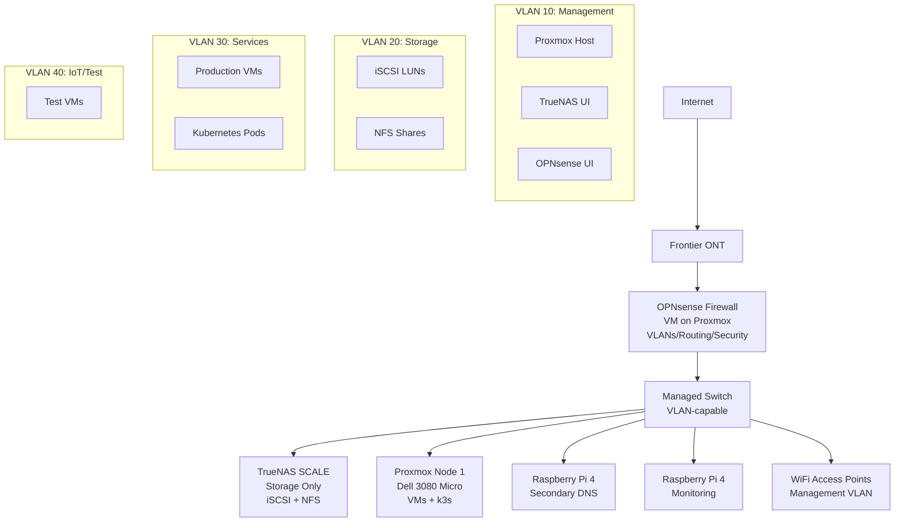

# Architecture Overview

## Design Philosophy

This homelab is designed around these principles:

1. **Separation of Concerns**
   - TrueNAS: Storage and data services
   - Proxmox: Compute and virtualization
   - Future OPNsense: Network and security
   - Kubernetes: Orchestration and cloud-native apps

2. **Learning-Focused**
   - Mirrors real enterprise infrastructure patterns
   - Emphasizes transferable skills for CompTIA certifications
   - Balances best practices with experimentation
   - Prioritizes stability for family-used services

3. **Incremental Growth**
   - Build on stable foundation
   - Add complexity gradually
   - Document decisions and lessons
   - Maintain rollback capability

4. **Cost-Effective**
   - Repurpose existing hardware where possible
   - Scale horizontally with inexpensive nodes
   - Leverage open-source solutions
   - Plan for future expansion

## Current Architecture

```mermaid
graph TB
    Internet[Internet<br/>Frontier 500Mbps]
    ONT[Frontier ONT]
    Deco[TP-Link Deco W7200<br/>Router/DHCP/WiFi<br/>192.168.1.1]
    Switch[YuanLey 8x2.5Gb Switch<br/>Unmanaged]
    
    TrueNAS[TrueNAS SCALE<br/>Xeon W-1370, 32GB<br/>3x4TB RAIDZ1<br/>~30 Services]
    ProxmoxCluster[Proxmox VE Cluster<br/>3x Dell OptiPlex Micro<br/>mostly idle]
    Desktop[MacBook Pro 14" M5 Pro<br/>Docked at home, portable]
    
    Internet --> ONT
    ONT --> Deco
    Deco -.mesh.-> DecoS4[Deco S4<br/>Desk]
    Deco -.mesh.-> DecoLR[Deco W7200<br/>Living Room]
    DecoS4 --> Switch
    Switch --> TrueNAS
    Switch --> ProxmoxCluster
    Switch --> Desktop
    
    subgraph "TrueNAS Services"
        Jellyfin[Jellyfin<br/>Family Streaming]
        Immich[Immich<br/>80k Photos]
        NPM[Nginx Proxy Manager<br/>Reverse Proxy]
        Tailscale[Tailscale<br/>VPN]
        ARR[*arr Stack<br/>Media Automation]
        LLM[Ollama + Open WebUI<br/>Local LLM]
        Cloud[Nextcloud + Collabora<br/>File Sync/Office]
    end
    
    TrueNAS --> Jellyfin
    TrueNAS --> Immich
    TrueNAS --> NPM
    TrueNAS --> Tailscale
    TrueNAS --> ARR
    TrueNAS --> LLM
    TrueNAS --> Cloud

    subgraph "Proxmox Workloads"
        DockerVM[docker-1 VM]
        BudgetLXC[actualbudget LXC]
    end

    ProxmoxCluster --> DockerVM
    ProxmoxCluster --> BudgetLXC
```

## Target Architecture (6-12 Months)



## Component Roles

### TrueNAS SCALE
**Role:** Centralized storage and data services

**Responsibilities:**
- ZFS storage pool management
- iSCSI LUNs for Proxmox VM storage
- NFS shares for Proxmox backups and k3s persistent volumes
- SMB shares for desktop access
- Data-heavy services requiring direct storage access (Jellyfin, Immich)
- Core infrastructure services that must stay up (Pi-hole when deployed)

**Why TrueNAS for Storage:**
- ZFS provides data integrity, snapshots, and compression
- Single source of truth for all persistent data
- Hardware-accelerated transcoding (Xeon iGPU for Jellyfin)
- Proven stable for family-critical services

### Proxmox VE
**Role:** Compute and virtualization platform

**Current State:** Live 3-node cluster (`homelab`), quorate. All current workloads (one Docker VM, one LXC) run on a single node; the other two nodes are online but idle. See [Proxmox Cluster Hardware](../02-hardware/proxmox-node.md) for per-node specs, including a known power-delivery issue on one node ([ADR-0102](../../decisions/0102-pve-node-power-delivery-fix.md)).

**Responsibilities:**
- Hypervisor for all virtual machines
- Host for Kubernetes cluster VMs (not yet deployed — see Next Steps)
- Test and development environments
- Future OPNsense firewall (VM with PCI passthrough or bridged networking)
- Learning platform for VM management

**Why Proxmox:**
- Industry-standard KVM/QEMU virtualization
- Web UI for easy management
- Excellent community support and documentation
- LXC containers for lightweight isolation
- Skills transfer to enterprise environments

### Kubernetes (k3s)
**Role:** Container orchestration and cloud-native applications

**Responsibilities:**
- Stateless microservices
- CI/CD runners
- Learning platform for Kubernetes concepts
- Auto-scaling and self-healing applications
- Modern deployment patterns (GitOps, service mesh, etc.)

**Why k3s:**
- Lightweight (perfect for homelab)
- Full Kubernetes compatibility
- Excellent for learning without cloud costs
- Easy to deploy and manage

### Raspberry Pi Nodes
**Role:** Edge services and high availability

**Responsibilities:**
- Secondary DNS (Pi-hole redundancy)
- Distributed monitoring agents
- Network services that survive main system reboots
- Low-power always-on services
- Potential k3s edge workers

**Why Raspberry Pi:**
- Low power consumption (~5W each)
- Reliable for always-on services
- Inexpensive horizontal scaling
- Good for distributed system learning

### OPNsense (Future)
**Role:** Network security and segmentation

**Responsibilities:**
- Routing between VLANs
- Firewall rules and intrusion detection
- VPN server (WireGuard/OpenVPN)
- DHCP and DNS for internal networks
- Traffic shaping and QoS
- Network monitoring and logging

**Why OPNsense:**
- Enterprise-grade features in open-source
- Excellent for CompTIA Security+ learning
- Active community and regular updates
- Powerful plugin ecosystem

## Data Flow Patterns

### Media Streaming (Current)
```
User Device → Tailscale/NPM → Jellyfin (TrueNAS) → /tank/media → Transcode (iGPU) → Stream
```

### Media Automation (Current)
```
Sonarr/Radarr → Prowlarr → qBittorrent (VPN) → /tank/media/downloads → *arr processing → Organized media
```

### Photo Backup (Current)
```
Mobile Device → Immich Upload → /tank/photos → ML Processing → Thumbnails/Search Index
```

### VM Storage (Future with Proxmox)
```
Proxmox VM → iSCSI over Storage VLAN → TrueNAS ZFS → RAIDZ1 Array
```

### Kubernetes Storage (Future)
```
k3s Pod → PVC → NFS CSI → TrueNAS NFS Share → ZFS Dataset
```

## Network Topology

### Current State
- Single flat network: 192.168.1.0/24
- Deco mesh handles DHCP and routing
- No VLANs or segmentation
- Unmanaged switch (no VLAN support)

### Target State (After OPNsense Migration)
- **VLAN 10** (192.168.10.0/24): Management - Proxmox, TrueNAS, OPNsense admin interfaces
- **VLAN 20** (192.168.20.0/24): Storage - iSCSI, NFS traffic with jumbo frames
- **VLAN 30** (192.168.30.0/24): Services - VMs, containers, production services
- **VLAN 40** (192.168.40.0/24): IoT/Test - Untrusted devices, test VMs
- **VLAN 50** (192.168.50.0/24): LAN - User devices, WiFi clients

**Firewall Rules:**
- Management VLAN: Highly restricted, admin workstation only
- Storage VLAN: Isolated, only accessible from Proxmox/k3s
- Services VLAN: Can access storage, restricted from management
- IoT/Test: Internet only, no access to other VLANs
- LAN: Can access services, not management or storage

## Design Decisions

See [decisions/](../../decisions/) folder for Architecture Decision Records (ADRs) documenting key choices.

**Key ADRs:**
1. Why TrueNAS for storage instead of Proxmox ZFS
2. Why k3s instead of full Kubernetes or Docker Swarm
3. Why two-phase network migration (Deco now, OPNsense later)
4. Why some services stay on TrueNAS vs. moving to Proxmox/k8s

## Scalability

### Current Capacity
- **Storage:** ~10.9TiB usable (RAIDZ1), ~48% allocated
- **Compute:** TrueNAS handles current Docker/App load; Proxmox cluster exists but is mostly idle (2 of 3 nodes have no workloads)
- **Network:** 500Mbps internet, 2.5Gb internal backbone sufficient for now

### Expansion Paths
1. **Storage:** Add vdev to RAIDZ1 pool, or expand to SAS drives with HBA
2. **Compute:** Add second Proxmox node (another mini PC), create cluster
3. **Network:** Upgrade to 10GbE backbone when needed (switch + NICs)
4. **Edge:** Add more Raspberry Pi nodes for distributed services

## Next Steps

1. Integrate Proxmox storage with TrueNAS (iSCSI/NFS) — not done yet, VMs currently use only node-local LVM-thin
2. Assign real workloads to the two idle Proxmox nodes
3. Deploy k3s (no Kubernetes exists anywhere in the homelab yet)
4. Set up automated snapshots and backups for Proxmox VMs
5. Plan OPNsense/VLAN network migration

---

*Last Updated: 2026-07-23*