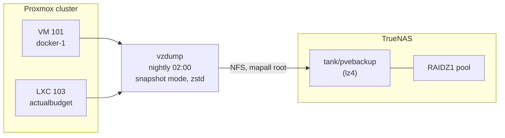

# Proxmox Backups to TrueNAS

How guest backups are configured, verified, and restored. The reasoning behind the target and method is in [ADR-0006](../../decisions/0006-proxmox-backup-strategy.md).

## Overview



Guest disks live on node-local LVM-thin with **no redundancy**. Backups are the only copy on redundant storage, and the only copy on a different physical machine.

## Setup

Performed once. Commands assume the TrueNAS host is `192.168.1.93` and the Proxmox nodes are `pve-01`/`pve-02`/`pve-03`.

### 1. Dataset on TrueNAS

Create through the middleware (`midclt`) rather than a raw `zfs create`, so TrueNAS registers it properly:

```bash
midclt call pool.dataset.create '{"name":"tank/pvebackup","compression":"LZ4"}'
```

### 2. NFS export

```bash
midclt call sharing.nfs.create '{"path":"/mnt/tank/pvebackup",
  "networks":["192.168.1.0/24"],"mapall_user":"root","mapall_group":"root",
  "comment":"Proxmox vzdump backups","enabled":true}'
```

`mapall_user: root` is **required**. Without it NFS squashes root and `vzdump` cannot write its dumps — the job fails with permission errors that look unrelated to NFS.

### 3. Register as cluster storage

Run once on any node. `/etc/pve` is a shared cluster filesystem, so the storage appears on all three:

```bash
pvesm add nfs pvebackup --server 192.168.1.93 \
  --export /mnt/tank/pvebackup --content backup \
  --prune-backups keep-daily=7,keep-weekly=4,keep-monthly=3
```

Confirm it mounted:

```bash
pvesm status          # pvebackup should show "active" with the pool's free space
```

### 4. Schedule the job

```bash
pvesh create /cluster/backup --schedule "02:00" --storage pvebackup \
  --mode snapshot --all 1 --compress zstd --enabled 1 \
  --notes-template "{{guestname}}-{{node}}"
```

`--mode snapshot` takes a storage-level snapshot and backs that up, so guests keep running. `--all 1` covers every guest in the cluster, including ones added later.

The resulting job lands in `/etc/pve/jobs.cfg`.

## Verifying a backup

Exit code 0 is not proof. Verify at three levels — the file exists, the archive is readable, and the data inside is sound.

```bash
# 1. Proxmox sees the backup
pvesm list pvebackup

# 2. Files actually landed (check from the NAS side, independently)
ls -lh /mnt/tank/pvebackup/dump/

# 3. Archive is not truncated — decompresses cleanly end to end
zstd -t /mnt/tank/pvebackup/dump/vzdump-lxc-103-*.tar.zst
```

`zstd -t` prints the decompressed byte count. Compare it against `Total bytes written` in the matching `.log` file — they should agree exactly.

## Restore test

**A backup you have not restored is a hypothesis.** Restore to a scratch VMID on a node that is *not* hosting the original, so nothing live is at risk:

```bash
# Restore to throwaway ID 999, do not autostart
pct restore 999 /mnt/pve/pvebackup/dump/vzdump-lxc-103-<timestamp>.tar.zst \
  --storage local-lvm --unprivileged 1 --hostname restoretest-999 --onboot 0
```

### Do not start a restored copy of the Actual Budget LXC

It carries a **static IP and Tailscale state**. Starting a second instance brings up `tailscaled` with the same node identity and can disrupt the live service's Tailscale URL. Verify at the filesystem level instead:

```bash
# Mount the restored rootfs read-only
lvchange -ay pve/vm-999-disk-0
mount -o ro /dev/pve/vm-999-disk-0 /mnt/restoretest

# Check the databases open and pass integrity check
python3 - <<'PY'
import sqlite3
for f in ["/mnt/restoretest/opt/actualbudget-data/server-files/account.sqlite"]:
    con = sqlite3.connect(f"file:{f}?mode=ro", uri=True)
    print(f, con.execute("PRAGMA integrity_check").fetchone()[0])
PY
```

Compare `sha256sum` of the restored file against the live one. The account database should match byte for byte; the **budget database will differ**, because Actual Budget writes continuously and the backup is a point-in-time snapshot. That difference is correct, not a fault.

Clean up afterwards:

```bash
umount /mnt/restoretest
pct destroy 999 --purge 1
```

### Result of the 2026-09-03 test

| Check | Result |
|-------|--------|
| Archive integrity (`zstd -t`) | clean, both guests |
| Restore extraction | 2,179,911,680 bytes — matched backup log exactly |
| `PRAGMA integrity_check` | `ok` on both databases |
| Account DB vs live | byte-identical (sha256 match) |
| Budget DB vs live | differed as expected — live had advanced since the snapshot |

## Known gap: failures are silent

The job notifies the built-in `mail-to-root` target, but the nodes have **no relayhost, no `root` alias in `/etc/aliases`, and no local mailbox**. Mail goes nowhere. A failing 02:00 job — TrueNAS down, share missing, pool full — produces no signal at all.

Check the delivery path before trusting it:

```bash
postconf -h relayhost        # empty = mail is going nowhere
grep '^root' /etc/aliases    # no alias = nothing forwarded
```

Until a real SMTP or webhook notification target is configured, verify manually:

```bash
# Did last night's run actually produce files?
ls -lht /mnt/pve/pvebackup/dump/ | head
```

## Restore-from-scratch notes

If restoring after losing a node entirely:

1. The storage definition lives in `/etc/pve/storage.cfg`, which is cluster-replicated — a surviving node already has it. A fully rebuilt cluster needs `pvesm add nfs ...` re-run (step 3 above).
2. Backups are plain files on the NAS; they survive the loss of every Proxmox node.
3. `qmrestore` for VMs, `pct restore` for containers.

---

*Last Updated: 2026-09-03*
