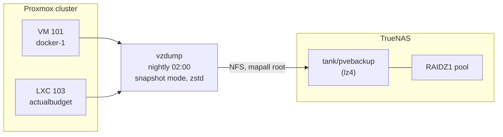

# Proxmox Backups to TrueNAS

How guest backups are configured, verified, and restored. The reasoning behind the target and method is in [ADR-0006](../../decisions/0006-proxmox-backup-strategy.md).

## Overview



Guest disks live on node-local LVM-thin with **no redundancy**. Backups are the only copy on redundant storage, and the only copy on a different physical machine.

## Setup

Performed once. Commands assume the TrueNAS host is `192.168.1.93` and the Proxmox nodes are `pve-01`/`pve-02`/`pve-03`.

### 1. Dataset on TrueNAS

Create through the middleware (`midclt`) rather than a raw `zfs create`, so TrueNAS registers it properly:

```bash
midclt call pool.dataset.create '{"name":"tank/pvebackup","compression":"LZ4"}'
```

### 2. NFS export

```bash
midclt call sharing.nfs.create '{"path":"/mnt/tank/pvebackup",
  "networks":["192.168.1.0/24"],"mapall_user":"root","mapall_group":"root",
  "comment":"Proxmox vzdump backups","enabled":true}'
```

`mapall_user: root` is **required**. Without it NFS squashes root and `vzdump` cannot write its dumps — the job fails with permission errors that look unrelated to NFS.

### 3. Register as cluster storage

Run once on any node. `/etc/pve` is a shared cluster filesystem, so the storage appears on all three:

```bash
pvesm add nfs pvebackup --server 192.168.1.93 \
  --export /mnt/tank/pvebackup --content backup \
  --prune-backups keep-daily=7,keep-weekly=4,keep-monthly=3
```

Confirm it mounted:

```bash
pvesm status          # pvebackup should show "active" with the pool's free space
```

### 4. Schedule the job

```bash
pvesh create /cluster/backup --schedule "02:00" --storage pvebackup \
  --mode snapshot --all 1 --compress zstd --enabled 1 \
  --notes-template "{{guestname}}-{{node}}"
```

`--mode snapshot` takes a storage-level snapshot and backs that up, so guests keep running. `--all 1` covers every guest in the cluster, including ones added later.

The resulting job lands in `/etc/pve/jobs.cfg`.

## Verifying a backup

Exit code 0 is not proof. Verify at three levels — the file exists, the archive is readable, and the data inside is sound.

```bash
# 1. Proxmox sees the backup
pvesm list pvebackup

# 2. Files actually landed (check from the NAS side, independently)
ls -lh /mnt/tank/pvebackup/dump/

# 3. Archive is not truncated — decompresses cleanly end to end
zstd -t /mnt/tank/pvebackup/dump/vzdump-lxc-103-*.tar.zst
```

`zstd -t` prints the decompressed byte count. Compare it against `Total bytes written` in the matching `.log` file — they should agree exactly.

## Restore test

**A backup you have not restored is a hypothesis.** Restore to a scratch VMID on a node that is *not* hosting the original, so nothing live is at risk:

```bash
# Restore to throwaway ID 999, do not autostart
pct restore 999 /mnt/pve/pvebackup/dump/vzdump-lxc-103-<timestamp>.tar.zst \
  --storage local-lvm --unprivileged 1 --hostname restoretest-999 --onboot 0
```

### Do not start a restored copy of the Actual Budget LXC

It carries a **static IP and Tailscale state**. Starting a second instance brings up `tailscaled` with the same node identity and can disrupt the live service's Tailscale URL. Verify at the filesystem level instead:

```bash
# Mount the restored rootfs read-only
lvchange -ay pve/vm-999-disk-0
mount -o ro /dev/pve/vm-999-disk-0 /mnt/restoretest

# Check the databases open and pass integrity check
python3 - <<'PY'
import sqlite3
for f in ["/mnt/restoretest/opt/actualbudget-data/server-files/account.sqlite"]:
    con = sqlite3.connect(f"file:{f}?mode=ro", uri=True)
    print(f, con.execute("PRAGMA integrity_check").fetchone()[0])
PY
```

Compare `sha256sum` of the restored file against the live one. The account database should match byte for byte; the **budget database will differ**, because Actual Budget writes continuously and the backup is a point-in-time snapshot. That difference is correct, not a fault.

Clean up afterwards:

```bash
umount /mnt/restoretest
pct destroy 999 --purge 1
```

### Result of the 2026-09-03 test

| Check | Result |
|-------|--------|
| Archive integrity (`zstd -t`) | clean, both guests |
| Restore extraction | 2,179,911,680 bytes — matched backup log exactly |
| `PRAGMA integrity_check` | `ok` on both databases |
| Account DB vs live | byte-identical (sha256 match) |
| Budget DB vs live | differed as expected — live had advanced since the snapshot |

## Notifications

Two distinct failure modes need catching, and most setups only handle the first:

| Failure mode | Caught by |
|---|---|
| Job **runs and fails** — NAS down, share gone, pool full | Proxmox notification target |
| Job **never runs at all** — scheduler broken, node off, cluster unquorate | *Nothing.* Silence looks exactly like success. |

The second needs a dead-man's switch: something that expects a heartbeat and complains when it stops arriving.

### Proxmox notification target (Discord webhook)

Proxmox VE 9 supports four target types: `gotify`, `sendmail`, `smtp`, `webhook`.

The Discord webhook URL is `https://discord.com/api/webhooks/<id>/<token>`. Register it so the **token stays out of the world-readable config** — Proxmox interpolates `{{ secrets.token }}` in the URL from its private store:

```bash
BODY='{"username":"Proxmox","embeds":[{"title":{{ json title }},"description":{{ json message }}}]}'

pvesh create /cluster/notifications/endpoints/webhook \
  --name discord --method post \
  --url "https://discord.com/api/webhooks/<id>/{{ secrets.token }}" \
  --secret "name=token,value=$(printf %s "<token>" | base64 -w0)" \
  --header "name=Content-Type,value=$(printf %s application/json | base64 -w0)" \
  --body "$(printf %s "$BODY" | base64 -w0)"
```

`--body`, `--header` values and `--secret` values are all **base64-encoded**.

Use the `{{ json ... }}` template helper rather than raw interpolation. It emits a fully-quoted JSON value, so quotes and newlines in vzdump output cannot break the payload — `vzdump` messages are multi-line and would otherwise produce invalid JSON.

Result: `/etc/pve/notifications.cfg` contains only the templated URL; the token lives in `/etc/pve/priv/notifications.cfg` (mode 0600).

Test it — note the path is `/targets/`, not `/endpoints/webhook/<name>/`:

```bash
pvesh create /cluster/notifications/targets/discord/test
```

Discord returns **HTTP 204** on success. A rejected payload shows up in `journalctl`.

### Matcher: failures only

```bash
pvesh create /cluster/notifications/matchers \
  --name backup-alerts \
  --match-severity error --match-severity warning \
  --target discord
```

**Do not route all severities.** A successful-backup message every night at 02:00 trains you to ignore the channel, and then you miss the one that matters. A message arriving should always mean something needs attention.

The built-in `default-matcher` still routes everything to `mail-to-root`, which goes nowhere on these nodes (no relayhost, no root alias, no local mailbox). Harmless, left in place. Verify your own mail path before relying on it:

```bash
postconf -h relayhost        # empty = mail is going nowhere
grep '^root' /etc/aliases    # no alias = nothing forwarded
```

### Weekly heartbeat

`/usr/local/bin/pve-backup-heartbeat.sh`, run by `pve-backup-heartbeat.timer` (Mondays 09:00, `Persistent=true` so a powered-off node still reports once back).

It reads the webhook URL *and* token out of Proxmox's own config, so the secret exists in exactly one place on disk. It reports the newest backup age per guest and flags anything older than 48 hours — so it is both a liveness signal and a coarse staleness check.

### Dead-man's switch (Uptime Kuma push monitor)

The notification target and the weekly heartbeat both still leave a gap: if the backup job silently stops running, the weekly heartbeat only surfaces it up to seven days later. A push monitor narrows that to one day.

Create a **Push** monitor in Uptime Kuma:

| Field | Value |
|---|---|
| Monitor Type | Push |
| Heartbeat Interval | `93600` (26 hours) |
| Retries | 0 |

**Use 26 hours, not 24.** The job runs at 02:00 and pushes on completion, so heartbeats land ~24h apart *exactly*. A 24-hour interval false-alarms on any drift (a slow backup, a delayed start); 26 hours absorbs that while still catching a genuinely missed night.

Store the push URL where only root can read it — `/etc/pve/priv/` is cluster-replicated, so one write covers every node:

```bash
printf %s "http://<kuma-host>:3001/api/push/<token>" > /etc/pve/priv/kuma-push-url
chmod 600 /etc/pve/priv/kuma-push-url
```

Then attach the hook script to the job (`/usr/local/bin/vzdump-kuma-hook.sh`, which must be copied to **every** node — `/usr/local/bin` is not cluster-replicated):

```bash
JOB=$(awk '/^vzdump:/{print $2}' /etc/pve/jobs.cfg)
pvesh set /cluster/backup/$JOB --script /usr/local/bin/vzdump-kuma-hook.sh
```

#### The trap: guestless nodes report success too

With `--all 1`, **every node runs the backup job** — including nodes with no guests, which log `Backup job finished successfully` after backing up nothing:

```text
pve-3000 pvescheduler: INFO: starting new backup job: vzdump ... --all 1
pve-3000 pvescheduler: INFO: Backup job finished successfully
```

A naive hook that pushes on `job-end` would therefore have idle nodes satisfying the heartbeat every night, keeping the monitor green even if the node holding the guests stopped backing up entirely — silently inverting the purpose of the check.

The hook guards against this with a marker file: `backup-end` (a guest was actually backed up) creates it, and `job-end` only pushes if it exists. A node with nothing to back up stays silent.

```bash
case "$phase" in
  job-start)     rm -f "$MARKER" ;;
  backup-end)    touch "$MARKER" ;;                 # real work happened
  job-end)       [ -e "$MARKER" ] && { push up "..."; rm -f "$MARKER"; } ;;
  job-abort)     push down "backup job ABORTED on $(hostname)" ;;
  backup-abort)  push down "backup of guest ${VMID:-unknown} ABORTED" ;;
esac
```

The hook also **exits 0 unconditionally** and uses a 10-second curl timeout. Monitoring must never become a failure mode for the thing it monitors — a down or slow Kuma must not break or delay a backup.

### Summary of layers

| Layer | Catches | Latency |
|---|---|---|
| Discord webhook target | job ran and failed | immediate |
| Uptime Kuma push monitor | job silently stopped running | ~1 day |
| Weekly heartbeat | pipeline liveness + stale backups | ~1 week |

## Restore-from-scratch notes

If restoring after losing a node entirely:

1. The storage definition lives in `/etc/pve/storage.cfg`, which is cluster-replicated — a surviving node already has it. A fully rebuilt cluster needs `pvesm add nfs ...` re-run (step 3 above).
2. Backups are plain files on the NAS; they survive the loss of every Proxmox node.
3. `qmrestore` for VMs, `pct restore` for containers.

---

*Last Updated: 2026-09-04*
