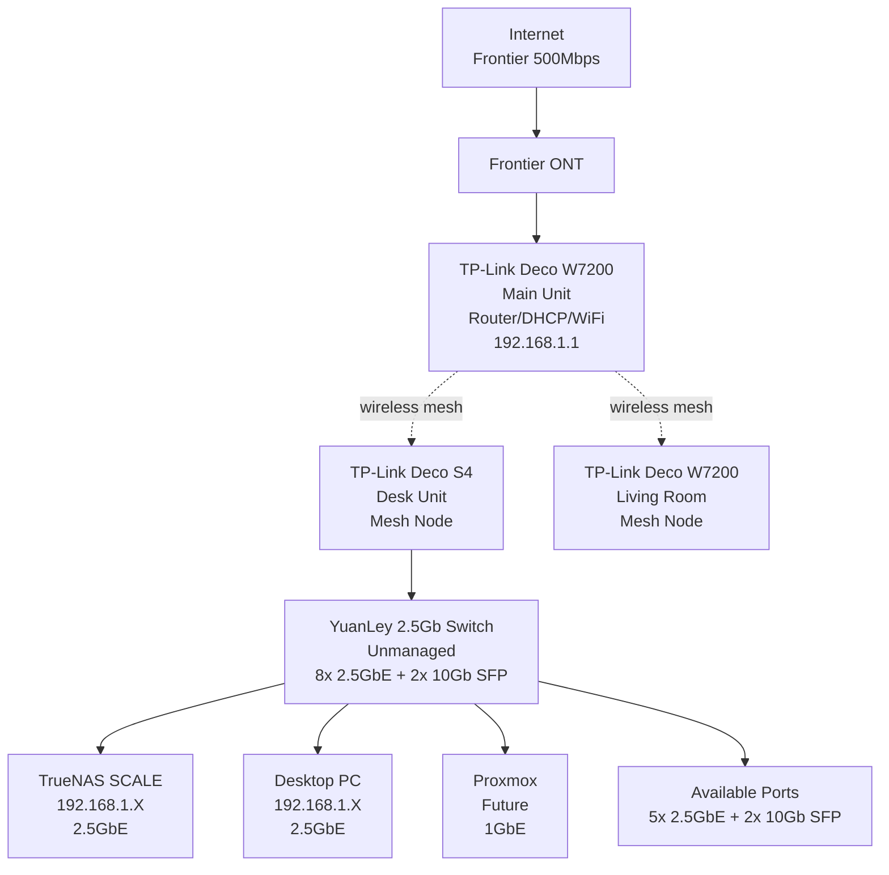

# Current Network Setup

## Network Overview

**Current State:** Simple flat network with consumer mesh WiFi system.

**Topology Type:** Single subnet, no VLANs or segmentation

**Management:** Consumer-grade router/mesh system

## Hardware Inventory

### Internet Connection
- **ISP:** Frontier Fiber
- **Speed:** 500 Mbps symmetrical
- **Connection Type:** Fiber to the home
- **Modem:** Frontier ONT (Optical Network Terminal)
- **Public IP:** Dynamic (managed via Cloudflare DDNS through TP-Link Deco)

### Router/WiFi System: TP-Link Deco Mesh
**Main Unit:** TP-Link Deco W7200
- **Location:** Connected directly to Frontier ONT
- **Role:** Router, DHCP server, primary WiFi access point
- **Connection:** Wired to ONT

**Desk Unit:** TP-Link Deco S4
- **Location:** Office desk
- **Role:** Mesh node, wired backhaul to switch
- **Connection:** Wireless mesh to main unit, wired to YuanLey switch

**Living Room Unit:** TP-Link Deco W7200
- **Location:** Living room
- **Role:** Mesh node, WiFi coverage extension
- **Connection:** Wireless mesh to main unit

**Deco System Capabilities:**
- Consumer mesh system with simplified management
- Limited VLAN support (app shows "IPTV/VLAN" section but unclear capabilities)
- Handles DHCP and basic routing
- Mobile app-based management (no web interface)
- Supports DDNS via TP-Link service

**Deco System Limitations:**
- No advanced firewall rules
- No proper VLAN tagging/segmentation for homelab
- Limited QoS capabilities
- Cannot run services like OPNsense or pfSense
- Difficult to integrate with enterprise-style network design

### Switch: YuanLey 8x 2.5Gb + 2x 10Gb SFP
- **Model:** YuanLey unmanaged switch
- **Ports:** 8x 2.5GbE RJ45 + 2x 10Gb SFP+
- **Management:** Unmanaged (plug and play, no configuration)
- **Location:** Connected to desk Deco S4 unit
- **Connected Devices:**
  - TrueNAS server (2.5GbE)
  - Desktop PC (2.5GbE)
  - Proxmox node (1GbE, when added)
  - Available ports: 5x 2.5GbE, 2x 10Gb SFP

**Switch Limitations:**
- Unmanaged = no VLAN support
- Cannot segment traffic or create isolated networks
- All devices on same broadcast domain

## IP Address Scheme

### Current Subnet
- **Network:** 192.168.1.0/24
- **Gateway/Router:** 192.168.1.1 (Deco W7200)
- **DHCP Range:** 192.168.1.100-192.168.1.254 (typical)
- **Static IPs:** Manually configured or DHCP reservations

### Known Device IPs
- **Gateway:** 192.168.1.1 (Deco router)
- **TrueNAS:** 192.168.1.X (should set to static, e.g., 192.168.1.10)
- **Proxmox:** 192.168.1.X (plan for static, e.g., 192.168.1.50)
- **Desktop PC:** 192.168.1.X (DHCP or static)
- **Raspberry Pis:** Not yet assigned

**IP Assignment Strategy:**
- 192.168.1.1 - Gateway (Deco)
- 192.168.1.10-19 - Infrastructure (TrueNAS, Proxmox, future OPNsense)
- 192.168.1.20-49 - Servers and services
- 192.168.1.50-99 - Reserved for future use
- 192.168.1.100-254 - DHCP pool for clients

## Network Services

### DHCP Server
- **Provided by:** TP-Link Deco W7200
- **Lease time:** Default (typically 24 hours)
- **Configuration:** Via Deco mobile app
- **Reservations:** Can set static DHCP assignments in app

### DNS
- **Primary DNS:** 192.168.1.1 (Deco forwards to ISP or configured DNS)
- **Upstream DNS:** Likely Frontier ISP DNS or 8.8.8.8
- **Local Resolution:** Deco provides basic local hostname resolution
- **Ad Blocking:** None currently (Pi-hole planned)

**Future Plan:** Deploy Pi-hole on Raspberry Pi for network-wide ad blocking and custom DNS

### Dynamic DNS (DDNS)
- **Service:** TP-Link DDNS (built into Deco app)
- **Domain:** example.com (registered with Cloudflare)
- **Purpose:** Keep DNS updated with home public IP for external access

**Cloudflare Integration:**
- Domain registered and managed via Cloudflare
- DNS records point to home IP
- Some records proxied through Cloudflare (orange cloud)
- Wildcard CNAME for subdomains (DNS-only, grey cloud)

### Firewall/Port Forwarding
- **Firewall:** Basic SPI firewall in Deco (consumer-grade)
- **Port Forwards:**
  - 80 (HTTP) → 192.168.1.X:80 (Nginx Proxy Manager)
  - 443 (HTTPS) → 192.168.1.X:443 (Nginx Proxy Manager)
- **UPnP:** Likely enabled by default (should disable)

### VPN
- **Tailscale:** Running as TrueNAS app
- **Purpose:** Secure remote access to entire homelab
- **Access:** All services accessible via Tailscale network
- **NetBird:** Also running but not actively used (may decommission)

**VPN Access Pattern:**
- Remote access: Connect via Tailscale
- External web access: Through Nginx Proxy Manager (ports 80/443)

## Network Performance

### Bandwidth
- **WAN:** 500 Mbps down / 500 Mbps up (Frontier Fiber)
- **LAN Backbone:** 2.5 Gbps (switch to TrueNAS/Desktop)
- **WiFi:** 
  - W7200: AX5400 (up to ~2400 Mbps theoretical)
  - S4: AC1200 (up to ~1200 Mbps theoretical)
  - Real-world: Varies by location, congestion

### Bottlenecks
- **Proxmox:** Only 1GbE NIC (will be bottleneck for iSCSI)
- **Mesh Backhaul:** Desk S4 is wireless mesh (should be wired if possible)
- **No Jumbo Frames:** Unmanaged switch, no MTU configuration

### Latency
- **Internal:** <1ms typical (wired devices)
- **WiFi:** 2-10ms depending on location and congestion
- **Internet:** ~10-30ms to major sites

## External Access

### Domain: example.com
- **Registrar:** Cloudflare
- **DNS Provider:** Cloudflare DNS
- **SSL Certificates:** Let's Encrypt via Nginx Proxy Manager

**Current DNS Records:**
- A record: example.com → Home public IP (proxied through Cloudflare)
- CNAME: * → example.com (wildcard, DNS-only)
- Subdomains: jellyfin, tracktor, jellyseerr (presumably)

### Reverse Proxy: Nginx Proxy Manager
- **Purpose:** Route external HTTPS traffic to internal services
- **SSL:** Automatic Let's Encrypt certificates (HTTP challenge)
- **Proxied Services:**
  - jellyfin.example.com → Jellyfin
  - tracktor.example.com → Tracktor
  - jellyseerr.example.com → Jellyseerr (if configured)

**Security:**
- Cloudflare proxy provides DDoS protection for some records
- NPM handles SSL termination
- All external traffic funneled through NPM

## Network Diagram (Current)

## WiFi Configuration

### SSID and Security
- **SSID:** [Primary network name]
- **Security:** WPA3 or WPA2/WPA3 mixed (typical for Deco)
- **Password:** Managed via Deco app
- **Guest Network:** Available but not configured

### WiFi Bands
- **2.4 GHz:** Longer range, lower speed, more congestion
- **5 GHz:** Shorter range, higher speed, less congestion
- **Band Steering:** Automatic (Deco handles client assignment)

### Coverage
- Main Deco (W7200): Primary coverage area near ONT
- Desk Deco (S4): Office/workspace
- Living Room Deco (W7200): Extended living area coverage

**Note:** S4 unit uses wireless backhaul which may reduce throughput. Consider running Ethernet if possible.

## Current Network Limitations

### Segmentation
- **No VLANs:** All devices on single broadcast domain
- **No isolation:** IoT devices, servers, workstations all on same network
- **Security risk:** Compromised device has access to entire network

### Management
- **Limited control:** Deco app is simplified, lacks advanced features
- **No SSH access:** Cannot SSH into Deco for advanced config
- **No packet inspection:** Cannot analyze traffic patterns or detect issues

### Scalability
- **Single subnet:** Will run out of IPs if many devices added
- **No QoS:** Cannot prioritize critical traffic (e.g., Jellyfin streaming)
- **No traffic shaping:** Cannot limit bandwidth per device/service

### Monitoring
- **Limited visibility:** Deco app shows basic device list and bandwidth
- **No flow analysis:** Cannot see which services use most bandwidth
- **No alerts:** No notification of network issues or anomalies

## Network Upgrade Path

### Phase 1: Immediate (Current State)
**Status:** Current configuration, no changes

**Actions:**
- Set static IPs for TrueNAS and Proxmox (via DHCP reservation or manual)
- Document current device IPs
- Test network performance baseline

### Phase 2: Proxmox Addition (Next 1-2 Weeks)
**Goal:** Add Proxmox node to network

**Actions:**
- Assign static IP to Proxmox (192.168.1.50)
- Connect Proxmox to YuanLey switch
- Configure Proxmox networking (single interface, no VLANs yet)
- Test connectivity between TrueNAS and Proxmox

### Phase 3: Managed Switch (1-3 Months)
**Goal:** Replace unmanaged switch with managed switch for VLAN support

**Requirements:**
- 8-port managed switch with 2.5GbE and VLAN support
- Options: TP-Link TL-SG3210XHP-M2, MikroTik CRS310-8G+2S+IN
- Budget: $150-300

**Benefits:**
- VLAN support for network segmentation
- Link aggregation (future)
- QoS and traffic shaping
- Port mirroring for monitoring

### Phase 4: OPNsense Deployment (3-6 Months)
**Goal:** Replace Deco router with OPNsense firewall/router

**Implementation Options:**
1. **OPNsense as Proxmox VM** (preferred for learning)
   - Virtualized router on Proxmox
   - Requires dual NIC or USB-to-Ethernet adapter for WAN/LAN separation
   - Can pass through NIC via PCI passthrough or use bridged networking

2. **OPNsense on dedicated hardware**
   - Small x86 box (mini PC or purpose-built appliance)
   - Separate from Proxmox for stability
   - Easier to manage WAN/LAN separation

**Network Changes:**
- ONT → OPNsense WAN port
- OPNsense LAN port → Managed switch
- Managed switch → All devices (segmented by VLANs)
- Repurpose Deco units as WiFi APs only (wired to switch)

**VLAN Design (Phase 4):**
- VLAN 10: Management (Proxmox, TrueNAS, OPNsense admin)
- VLAN 20: Storage (iSCSI/NFS traffic)
- VLAN 30: Services (VMs, containers)
- VLAN 40: IoT/Test (untrusted devices)
- VLAN 50: LAN (user devices, WiFi clients)

### Phase 5: WiFi Access Points (3-6 Months)
**Goal:** Replace Deco mesh with proper access points

**Options:**
- **TP-Link Omada:** EAP670 or EAP660 HD
- **UniFi:** U6-Pro or U6-Lite
- **MikroTik:** cAP AX or wAP AX

**Requirements:**
- Support VLAN tagging (for WiFi client segmentation)
- PoE powered (from managed switch)
- Centrally managed (Omada Controller, UniFi Controller, etc.)
- Fast roaming for seamless handoff

**Placement:**
- 2-3 APs for whole-home coverage
- Wired backhaul to managed switch (no mesh)
- Each AP on management VLAN, broadcasts multiple SSIDs for different VLANs

### Phase 6: Advanced Features (6-12 Months)
**Goal:** Enterprise-grade network with full segmentation and monitoring

**Features:**
- **IDS/IPS:** Intrusion detection via OPNsense Suricata plugin
- **VPN:** WireGuard or OpenVPN server on OPNsense
- **QoS:** Traffic prioritization (VoIP, gaming, streaming)
- **Monitoring:** Prometheus + Grafana for network metrics
- **DNS:** Pi-hole on Raspberry Pi (redundant pair)
- **Firewall Rules:** Inter-VLAN routing with strict rules

## Raspberry Pi Network Integration

### Planned Pi Deployments
**2x Raspberry Pi 4:**
- Primary: Pi-hole DNS + monitoring collector
- Secondary: Backup Pi-hole DNS + lightweight services

**1x Pi Zero 2W:**
- Edge service or sensor node

### Pi Networking
**Phase 1 (Current Network):**
- Connect to existing network via Ethernet or WiFi
- Assign static IPs (192.168.1.20-29)
- Services accessible via Tailscale

**Phase 2 (With VLANs):**
- Place on Services VLAN (VLAN 30) or dedicated Pi VLAN
- Pi-hole on Management VLAN for maximum uptime
- Consider Pi-hole HA (keepalived + floating IP)

## Security Considerations

### Current Security Posture
**Strengths:**
- Tailscale provides secure remote access (better than open ports)
- Nginx Proxy Manager centralizes external access
- Cloudflare proxy protects some services
- Deco firewall blocks unsolicited inbound traffic

**Weaknesses:**
- No network segmentation (flat network)
- All devices trust each other (no zero-trust)
- Limited visibility into traffic
- Cannot isolate untrusted devices (IoT)
- No IDS/IPS
- Consumer-grade firewall (limited rules)

### Future Improvements (OPNsense)
- **Inter-VLAN firewall rules:** Default deny, explicit allow
- **IDS/IPS:** Detect and block malicious traffic
- **GeoIP blocking:** Block traffic from high-risk countries
- **DNS filtering:** Block malicious domains (with Pi-hole)
- **VPN:** Secure access without exposing services

## Maintenance Schedule

### Weekly
- Check Deco app for device anomalies
- Verify external access (jellyfin.example.com)
- Review Tailscale connections

### Monthly
- Reboot Deco mesh system
- Check for Deco firmware updates
- Verify DDNS is updating correctly
- Review port forwards and firewall rules

### Before Major Changes
- Document current network configuration
- Test connectivity to all critical services
- Backup Deco settings (if possible via app)
- Plan rollback procedure

## Troubleshooting

### Common Issues

**Internet down:**
- Check ONT lights (should be solid green)
- Reboot Deco main unit
- Check Frontier service status

**Device can't connect:**
- Verify DHCP is working (check IP assignment)
- Check WiFi password
- Reboot device and Deco

**Slow speeds:**
- Test wired vs. WiFi
- Check mesh backhaul status (wireless can be slow)
- Reboot Deco units
- Check for interference (neighbors' WiFi)

**Can't access external services:**
- Verify DDNS has updated (check Cloudflare DNS)
- Check port forwards (80, 443 to NPM)
- Verify NPM is running on TrueNAS
- Check Cloudflare proxy status (orange vs. grey cloud)

## Next Steps

1. Set static IPs for TrueNAS and Proxmox
2. Document all current device IPs and MAC addresses
3. Test network performance baseline (iperf3 between devices)
4. Research managed switches for future upgrade
5. Plan OPNsense deployment strategy (VM vs. dedicated hardware)

---

*Last Updated: 2025-01-26*